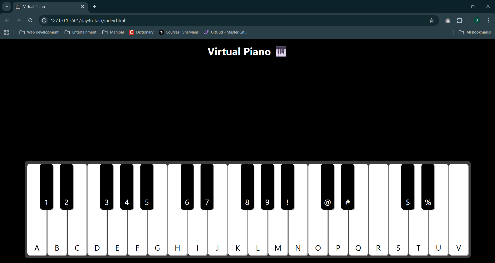

# Task: Virtual Piano
- In this repository I have created a piano which can be controlled with keyboard keys as well as buttons on piano
- Each key has a unique sound and is available in `sounds` directory
- I have made use of pointer events to combine touch and click on both mobile and desktop

## Task Completion Screenshot (1600px display)
